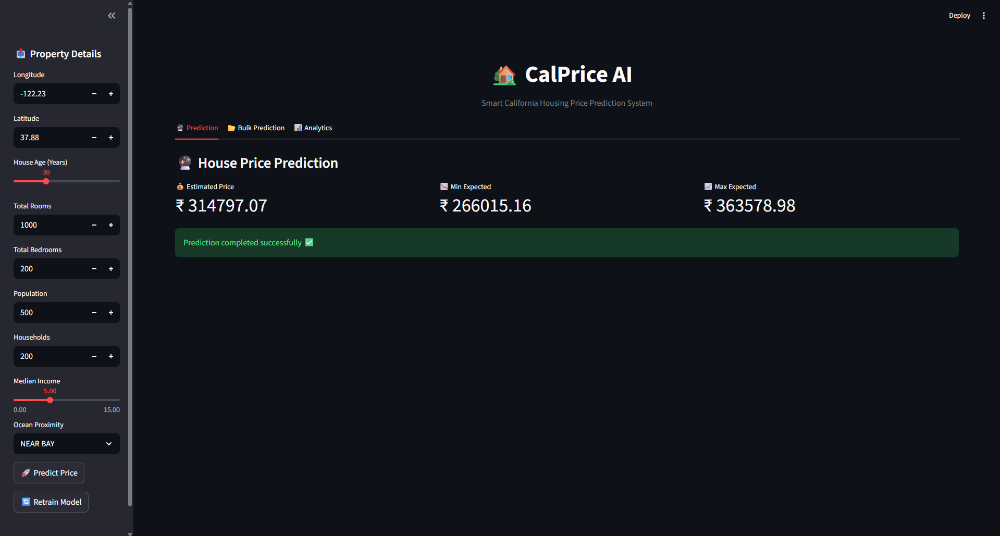

# 🏡 CalPrice AI – California Housing Price Predictor

CalPrice AI is an AI-powered web application that predicts house prices in California using Machine Learning.  
The system provides instant price predictions, confidence range, feature importance visualization, bulk CSV prediction, and model analytics.

Built using Python, Scikit-learn, and Streamlit.

---

## 📌 About the Project

CalPrice AI is designed to help users estimate house prices based on real-world housing data from the California Housing Dataset.  
Users can input property details such as geographical location, housing age, number of rooms, population, income level, and proximity to the ocean.  
The application processes this data using a trained machine learning model and predicts the estimated house value instantly.

The goal of this project is to demonstrate a complete machine learning workflow:
- Data preprocessing
- Model training and evaluation
- Model deployment with UI
- Real-time prediction
- Analytics and explainability

This project is suitable for academic learning, portfolio showcase, hackathons, and real-world demos.

---

## 🚀 Features

- Instant house price prediction
- Confidence range (Min–Max price)
- Bulk CSV prediction and download
- Model accuracy dashboard (R², MAE, RMSE)
- Feature importance visualization
- Prediction history tracking
- Retrain model from UI
- Clean professional UI
- Production-ready project structure

---

## 🖥️ Tech Stack

- Python 3.9+
- Scikit-learn
- Pandas
- NumPy
- Streamlit
- Joblib

---

## 📁 Project Structure
## 📁 Project Structure

```
PROJECT/
│
├── app.py
├── final.py
├── requirements.txt
├── metrics.txt
├── README.md
│
├── data/
│   ├── housing1.csv
│   ├── history.csv
│   ├── input.csv
│   └── output.csv
│
├── model/
│   ├── model.pkl
│   └── pipeline.pkl
│
└── src/
    ├── predictor.py
    ├── history.py
    └── metrics.py
```

## ⚙️ Installation

### Step 1 — Clone Repository
```
git clone (https://github.com/Kunj2448/CalPrice.git) 
cd your-project-folder
```
---

### Step 2 — Create Virtual Environment (Recommended)

Windows:
```
python -m venv venv  
venv\Scripts\activate  
```
Mac/Linux:
```
python -m venv venv  
source venv/bin/activate  
```
---

### Step 3 — Install Dependencies
```
pip install -r requirements.txt
```
---

## 🧠 Train the Model
```
python train_model.py
```
This will:
- Train the ML model
- Evaluate performance
- Save model and pipeline
- Generate metrics.txt
- Generate output.csv

---

## ▶️ Run the Application
```
streamlit run app.py
```
The web browser will open automatically.

---

## 📊 Sample Model Performance
```
R2 Score : 0.8184  
Accuracy (%) : 81.84%  
MAE : 31465.25  
RMSE : 48781.91  
```
---

## 📂 Bulk Prediction CSV Format

CSV file must contain the following columns:

longitude  
latitude  
housing_median_age  
total_rooms  
total_bedrooms  
population  
households  
median_income  
ocean_proximity  

---

## 🎯 How It Works

1. User enters house details in the UI.
2. Data is processed using preprocessing pipeline.
3. Trained ML model predicts house price.
4. Confidence range is calculated using RMSE.
5. Analytics and prediction history are updated automatically.

---

## 🔄 Retrain Model

Use the Retrain Model button in the sidebar to retrain the model using the dataset.

---

## 📈 Feature Importance

The Analytics tab displays:
- Most important features affecting house prices.
- Graphs for explainability.

---

## 📌 Future Enhancements

- Map visualization
- PDF report generation
- User authentication
- Cloud deployment
- Mobile-friendly UI

---

## 📷 Application Preview


